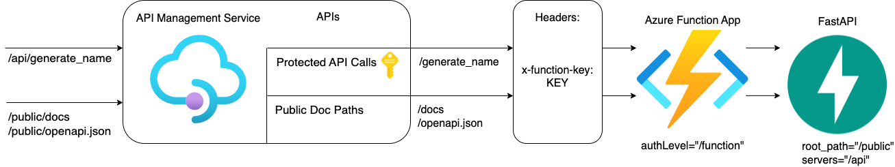

[](https://github.com/codespaces/new?hide_repo_select=true&repo=pamelafox%2Ffastapi-azure-function-apim)

This repository includes a simple HTTP API powered by FastAPI, made for demonstration purposes only.
This API is designed to be deployed as a secured Azure Function with an API Management service in front.



Thanks to the API Management policies, making calls to the actual API requires a subscription key,
but viewing the auto-generated documentation or OpenAPI schema does not.
The Azure Function has an authentication level of "function",
so even if someone knows its endpoint, they can't make calls to it without a function key.
The API Management service _does_ know the function key, and passes it on.
[Learn more about the approach in this blog post.](http://blog.pamelafox.org/2022/11/fastapi-on-azure-functions-with-azure.html)

## Opening the project

This project has devcontainer support, so it will be automatically setup if you open it in Github Codespaces or in local VS Code with the Dev Containers extension.

If you're unable to open the devcontainer, then you'll need to:

1. Create a [Python virtual environment](https://docs.python.org/3/tutorial/venv.html#creating-virtual-environments) and activate it.

2. Install requirements:

```shell
python3 -m pip install --user -r requirements-dev.txt
```

3. Install the [Azure Dev CLI](https://learn.microsoft.com/azure/developer/azure-developer-cli/install-azd).

## Local development

Use the local emulator from Azure Functions Core Tools to test the function locally.
(There is no local emulator for the API Management service).

1. Open this repository in Github Codespaces or VS Code with Remote Devcontainers extension.


2. Open the Terminal and make sure you're in the root folder.
2. Run `PYTHON_ISOLATE_WORKER_DEPENDENCIES=1 func host start`
3. Click 'http://localhost:7071/{*route}' in the terminal, which should open the website in a new tab.
4. Change the URL to navigate to either the API at `/generate_name` or the docs at `/docs`.

## Deployment

This repo is set up for deployment using the
[Azure Developer CLI](https://learn.microsoft.com/en-us/azure/developer/azure-developer-cli/overview),
which relies on the `azure.yaml` file and the configuration files in the `infra` folder.

[🎥 Watch a screencast of deploying and testing the app.](https://youtu.be/FPyq_aLzmIY)

Steps for deployment:

1. Sign up for a [free Azure account](https://azure.microsoft.com/free/)
2. Initialize a new `azd` environment:

    ```shell
    azd init
    ```

    It will prompt you to provide a name (like "fast-func") that will later be used in the name of the deployed resources.

3. Provision and deploy all the resources:

    ```shell
    azd up
    ```

    It will prompt you to login, pick a subscription, and provide a location (like "eastus"). Then it will provision the resources in your account and deploy the latest code.

4. Once it finishes deploying, navigate to the API endpoint URL from the output.
5. To get a subscription key for API calls, navigate to the portal URL from the output, open the _Subscriptions_ page from the side nav, and copy one of the built-in keys.

### CI/CD pipeline

This project includes a Github workflow for deploying the resources to Azure
on every push to main. That workflow requires several Azure-related authentication secrets to be stored as Github action secrets. To set that up, run:

```shell
azd pipeline config
```

### Monitoring

The deployed resources include a Log Analytics workspace with an Application Insights dashboard to measure metrics like server response time.

To open that dashboard, run this command once you've deployed:

```shell
azd monitor --overview
```

## Costs
(only provided as an example, as of Nov-2022)

Costs for this architecture are based on incoming traffic / usage, so cost should be near $0 if you're only testing it out, and otherwise increase based on your API usage.

- API Management - Consumption tier: $3.50 per 1 million calls. The first 1 million calls per Azure subscription are free. [Pricing](https://azure.microsoft.com/pricing/details/api-management/)
- Azure Functions - Consumption tier: $0.20 per 1 million calls. The first 1 million calls per Azure subscription are free. [Pricing](https://azure.microsoft.com/pricing/details/functions/)
- Storage account - Standard tier (Hot): $0.0255 per used GiB, 	$0.065 per 10,000 write transactions. The account is only used to store the function code, so cost depends on size of function code and number of deploys (but should be quite low). [Pricing](https://azure.microsoft.com/pricing/details/storage/files/)
- Application Insights: $2.88 per GB ingested data. The first 5 GB per billing account are included per month. [Pricing](https://azure.microsoft.com/pricing/details/monitor/)


## Getting help

If you're working with this project and running into issues, please post in [Discussions](/discussions).
